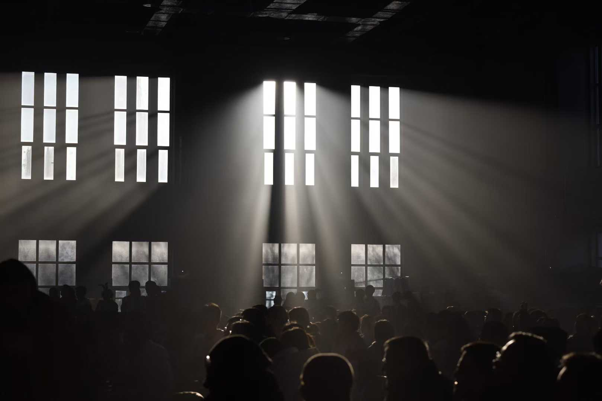
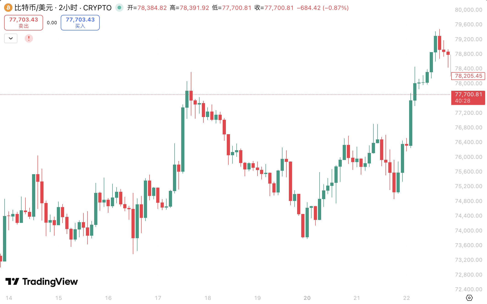

:::quote
繁华在生命中凋零，在记忆中绽放
:::

四月二十二，真正进入大考季了。今年的大考季不同往年，我已经是拿到ED offer的人了。!!对于美本申请的人来说，大考只是毕业的要求之一，所以对我个人而言并没有那么重要。!!但是生活好像并没有那么放松，无数的事情缠绕着我，故写下这篇文章，舒展近期所想

## 关于毕业

五月二十二的送别会之后，高三所有的学生就要离校了，距离写这篇文的时候，还有整整一个月的时间。还要为送别会和毕业典礼做筹划，不知道自己的毕业典礼镜头签计划能不能顺利实现。年前刚从Nikon的D750换到了Sony的A7M5机身，换门之后视频能力得到明显提升的我开始频繁的拍摄动态影像。作为经常看CS比赛的人，我对镜头签有着别样的感情，我也希望在高中毕业之际，能留下这样一段珍贵的影像。

关于签名，我预计定制3块高透亚克力板，搭配鬼手来拍摄。我的计划是在毕业典礼之前购买一支唯卓仕14mm f4.0来当做我的拍摄镜头。平常24-105的挂机头对于镜头签来说有点太长，而且0.3m的对焦距离让我必须买一个9寸甚至更大的鬼手。而唯卓仕这颗镜头不仅有我需要的足够短焦，还有10cm出头的对焦距离。这也说明我可能用一个7寸鬼手就能胜任这个任务，便携性提高了不少。而这样一颗完全符合我拍摄需求的镜头在闲鱼买全新竟然只需要850元。找不到比这更好的方案了。

## 关于大学

高三上半学期的时候因为学习太过忙碌没有时间研究NYU的繁杂事务，考完学术写作的分班考就把所有东西抛之脑后了，Mock结束之后才发现北京的美国大使馆F1学签面签已经预约到七月中去了。赶紧填了DS-160准备去面签。健康证明还需要体检和疫苗，都是要在大考季完成的事情。

关于对大学的畅想，我希望纽约是和我心里的纽约一样的。上一次去纽约是18年的时候，之后两次高中时期去美国学习都在加州，第一年在UCLA很顺利拿到了4分，第二年在UCB还有一科差点挂了 >_< 。[CS61C](https://cs61c.org)对于当时的我确实还是有一定难度的，夏季学期太紧的时间也让我没办法在仅有的lab里复习足够，希望在NYU的EE学习生活能顺利吧。

## 最近在忙的事情

最近想干的事情特别特别多，包括探索大学、学习交易、打CS等等......

### 探索NYU

NYU 2030成立了官方的Discord Server，里面活跃的大多是外国人，中国人还是更习惯在微信里交流。1月的新生见面会过后，大家在群里聊的无非是学校信息和找室友。我的工程学院Tandon在Brooklyn，而我们的宿舍离学校走路竟然只需要两分钟，可能这也是布鲁克林学生的好处吧，到了大二可能还会出去住。

NYU的学生宿舍也和去过的UC Berkeley布局差不多，但是我们的Apartment多出来了一个厨房。两个人一个房间、两个房间一个厕所的布局很不错。

### 交易市场

交易市场近期依然不平，大多数标的都在横盘震荡。还好最近手里并没有现货，还在学习途中。ETHUSDT依然还在2250-2400左右，最近有几个朋友靠抓以太坊的箱体结构赚了一些钱。BTCUSDT一直在受到国际形势的影响，霍尔木兹海峡的开开合合影响了BTC，而BTC又影响着整个crypto市场的情绪。横盘几十个小时的BTC在霍尔木兹海峡开放的那一刻就涨上了77000USDT。而好景不长，海峡再次关闭，4月19日晚上九点，手机就收到了BTC又跌下74000USDT的通知。反复了两次，到这篇文章写作的时候，BTC孤立高点已经来到79500，差500美金就要重回80000大关。想到一个月前的人们还在探讨60000和74000价位加仓的时候，看看现在的价格，也就释怀了。

## 总结

最近调整状态很重要。找到自己想做的事情，应该做的事情，不要浪费太多时间了。感觉现阶段有点被看似的“正事”束缚住了，希望跳出这个漩涡吧。打好游戏，学好交易，拍好照片。一直向前走，假期就在眼前。