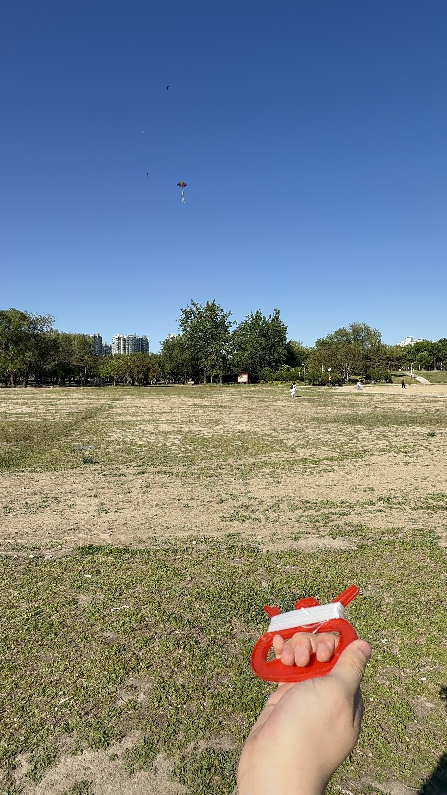
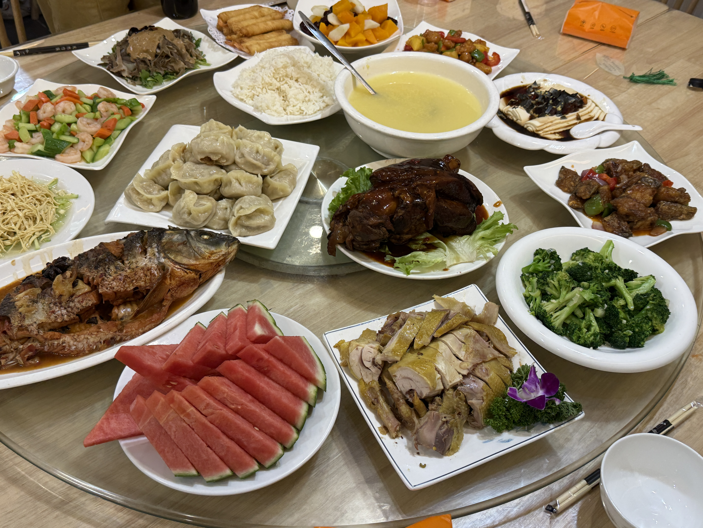

I had a pretty packed May Day holiday. If I don't publish this Blog soon, my memory is going to expire, so I’m squeezing this out while I still have a bit of time.

## Apr 28｜Customs Medical Checkup

Things happened to be relatively chill before the holiday, so I booked a medical checkup at the General Administration of Customs. I hadn’t been to Dongcheng in ages, and honestly, Dongcheng District has such an old-timey vibe hahaha. Since I still have my F-1 visa from UC Berkeley last year, I could get the checkup for free. I went quite early in the morning, got my number, waited for about twenty minutes, and then it was my turn.

The checkup started with a routine blood test and went item by item from there. When I got to the department where they asked for my height and weight, I somehow forgot my own weight. Later I realized the number I gave was a few jin off from my actual weight, but I guess it should be fine......

Every doctor doing the checks kept saying I was in very good health, but why do I feel like my body belongs to an old man (sadge)? I often get lower back soreness and random body aches, and sometimes I even feel like I can’t breathe properly. Maybe I really need to get a massage and relax a bit. Being young isn’t easy on the body either.

I also got my missing vaccine done at Customs while I was there: a meningococcal A + C shot. The last time I got this vaccine was in fifth grade, and the record had already expired. I don’t know why a subcutaneous vaccine was given to me with what looked like an intramuscular injection syringe. Maybe I remembered it wrong though (

After the checkup, I went with my dad to a Xinjiang noodle place we often visit. As good as always. I really need noodles in my life. I hope I can still find noodles this good after going to the US, to save my wounded soul.

## Apr 29｜Flying Kites

On the afternoon of the 29th, school canceled the last two classes and took us to Taiyanggong Park next to the school to fly kites.

The sky was perfectly clear that afternoon, not a cloud in sight. Unfortunately, there was also not a single bit of wind, and the temperature was pretty high. Even the best cook can’t make a meal without rice, so a lot of classmates couldn’t get their kites up at all. They just kept running while dragging the kite string. Then, of course, two hours later, right when the activity ended, the wind suddenly started blowing.

Since there weren’t many people in our class to begin with, everyone got their own kite. After I got mine into the air, I went to help others, and managed to get quite a few kites flying. My grandpa is actually very good at flying kites, so even without a kite reel, I could let the string out fast enough by hand, and the kite still went pretty far.

## May 1–May 3｜Trip to Panshan

During the May Day holiday, I spent the first three days with friends in Panshan, Tianjin. We stayed there for two nights. There were both adults and kids, all friends of my parents.

### May 1

At the foot of Panshan, there are dense rows of rural guesthouses. Since we had so many people, we almost booked out an entire one. This was my second time there, so everything felt familiar. It had changed quite a lot compared with the first time I went. The lounge in the middle of the lake had even been turned into a guest room.

We went to the free market at the foot of Panshan. Besides all kinds of dried goods, there were also many fireworks, so we bought some sparklers. They looked pretty good at night. Under the night sky, I wanted to photograph the moon. It happened to be the fifteenth day of the lunar month. I went upstairs with my camera and tripod, only to realize I hadn’t brought the memory card. So I had to put the camera down and go back to the room to get it. Sadly, there were a lot of clouds that day, and visibility wasn’t great either. The moon came out extremely hazy, with only a rough outline. Since the shooting conditions were so bad, I didn’t end up getting any usable shots.

### May 2

On the morning of May 2, we officially started climbing the mountain. Only three adults and a few of us kids went up. The rest of the adults stayed at the hotel playing cards. We walked for twenty minutes just to reach the foot of the mountain. Then the climb began.

The shooting conditions that day were quite good, so I took a lot of photos and videos of the kids. Along the way, there were even NPCs cosplaying Qing dynasty merchants and selling things. There was even someone cosplaying Emperor Qianlong. Since Qianlong often visited this area, the scenic spot really did put in some effort. We also ran into people singing and showing off their talents on the road.

We walked for two or three hours and finally climbed to a large platform. I thought we had reached one section of the scenic area, only to find out that we had just arrived at the actual entrance gate. The gate we entered before was only the archway at the foot of the mountain, and the path we had been walking was still the mountain road before entering the official scenic area. But by then it was already eleven o’clock, and we weren’t planning to eat inside the scenic area. So after entering just a little bit, we started heading back.

Then something dramatic happened. There was a waterfall partway up the mountain, with some stone paths nearby. Some people chose to walk that way, and I followed with my camera in hand. Since I was filming video, all my attention was on the camera. When I jumped across the waterfall, I stepped right onto a wet, slippery leaf, and my whole body fell down. It scared me quite a bit. To protect the camera, I supported myself with my left hand when I landed, but my left ankle twisted hard, and my hand also got several cuts. Fortunately, the camera was fine. Since I was injured, we decided to head straight back to the hotel for lunch.

I originally thought I could keep climbing for a while, but after the fall, even walking became a problem. So I could only go back and rest. In the afternoon, I had no choice but to play mahjong indoors with the adults.

### May 3

This was the least congested day of the holiday. We drove back to Beijing early in the morning, and the road was completely smooth. We got there in just over an hour.

## May 4｜Car Wash

The same group of people came to the northwest Fifth Ring area again. This time, it was a parking lot owned by a friend’s relative. We went there for a meal, and we could also use the parking lot’s water hose to wash cars. We washed cars for the entire day and got my dad’s car shining like new.

## May 5｜Rest

On the last day of the holiday, I stayed home and rested. The big exams are approaching, yet I’m still in an extremely relaxed state. Right now, the only truly urgent thing might be sorting out my college enrollment. As for the closing chapter of high school, it will end by itself eventually.

## What I’ve Been Busy With Recently

### Claude

Finally, this guy has also started using Claude. Because Anthropic’s risk control mechanism is way too strict, even a tiny DNS leak or an unclean IP can get you instantly banned. One of my previous Google accounts was banned without a word, so I had been using GPT ever since.

But I really wanted an AI with a more human touch. By chance, while scrolling through YouTube, I saw a pretty cheap residential IP provider, so I bought one directly. Add a fingerprint browser on top, and just like that, I began happily using Claude.

As for Claude Code, which has been all over the internet, I still haven’t started using it. On one hand, I’m afraid that if I don’t isolate the environment properly, I’ll get banned again !!(this time I really can’t afford to gamble; if my main account gets banned I might as well jump, and anyway I’ll be going to the US soon. I don’t have much programming foundation right now, so I can just use it later)!! On the other hand, I feel like I don’t currently have many scenarios where I would need Claude Code. I did think about connecting it to my Obsidian so it could help summarize notes, but then I realized I don’t really have many notes to take right now, so I’ll leave it aside for the moment.

Claude and ChatGPT really are two completely different products. To adapt quickly, I asked GPT to write me a “recommendation letter” and a bunch of documents to help Claude form an initial understanding of me and know what I’ve been busy with recently. The moment I started using it, I could already feel the biggest differences between the two.

GPT often gives me many different solutions. No matter what I want to explore, it follows my train of thought and gives me very detailed explanations. In contrast, I feel that Claude’s thinking time is noticeably shorter. When I ask questions, she also actively asks me about my needs in return. Sometimes, without saying much, she just starts working, and while I’m still confused, she hands me a pile of code and files that are already written. Similarly, Claude sometimes gives me advice that is completely opposite to what I had in mind, and it often feels quite fair and reasonable. As someone used to GPT, this was very uncomfortable at first, but I did indeed see something in Claude that GPT doesn’t quite give me.

But things weren’t exactly as I expected. After using it for a few days, I realized that GPT’s answer style and way of thinking may still suit a STEM guy like me better. Claude’s methods and solutions often lean too much toward ideas and idealized thinking. GPT is still the one that matches me best, so I’ll probably continue using GPT. Claude can just be a little chat toy.

### Personal Asset Organization and Account Migration

Time after adulthood has been passing ridiculously fast. I’ve been buried in all kinds of mocks and monthly exams, and never had much time to manage my accounts and assets — although, to be fair, I don’t really have much in the way of assets. Since I had just registered a new Google account, and I also didn’t really feel like taking the big exams seriously anymore, I simply started working on all this together with AI.

First is the password manager. I really need a good password manager to help me sort out all these accounts. Besides the AutoFill inside browsers, I also need a separate, secure carrier that can properly store my things. I had been using Bitwarden before. As one of the top industry benchmarks, it had always worked pretty well. But this time, I chose to switch to KeePassXC, a local encrypted manager.

I’ve always had fairly strong resistance toward things stored in the cloud. It’s not that I dislike the feeling of synchronization. It’s just that, under the general domestic internet environment, any secret uploaded to the cloud before being locally encrypted always makes me feel uneasy.

The current plan is to use KeePass as my password manager, and it can also display TOTP. Meanwhile, Obsidian will have a new vault as my ledger. It won’t store the actual content itself, but it will tell me where each item is stored and when it was last updated. Finally, there is VeraCrypt. I haven’t started using it yet, but it is an encrypted container that can be mounted on a computer like a hard drive. I plan to put some of my important documents in it, such as passport PDFs and school I-20s, just in case.

Recently, I’ve also been learning trading. Unfortunately, time is limited, so progress has been a bit slow, and I really need to pull myself together. I’ve already received an IBAN from N26 Bank, which means I now have a properly licensed European bank account and can use a debit card for various purchases. The U card from Fiat24 that came with Bitget Wallet was easily rejected in many scenarios. Maybe it’s only good for ordering food on Meituan. Now, not only do I have N26, but I also have a Wise account, so currency exchange is no longer a problem. The exchange loss is also much lower than with normal banks. After using things for a few months, I’ve finally connected the whole overseas spending loop. Once I have time to get a Hong Kong bank card, and then open a BOA account in the US, it will basically be complete.

### Recent Market

Absolutely insane. BTC directly broke above the 82,000 level and already seems to be showing signs of holding there. ETH also rose to 2,400. If BTC can continue recovering and even break the four-year cycle by reaching 100k, then maybe it will be time to look toward the previous high.

### Gaming

#### CS2

Recently, I really haven’t had any time to play games. I’ve still been switching between Perfect World and 5E, and I haven’t reached A on either one. I don’t know if I can fulfill this dream before going to the US. What I should actually do now is practice all maps and utility, because only knowing how to play Mirage is obviously not a good thing. Faceit randomly matches across all maps, so if my strength varies wildly from map to map, it’s going to be painful.

#### KARDS

I’m returning to the game. After the previous cards entered the reserve pool, I didn’t open the game for a long time. Recently I started playing again because the official team announced that they’re releasing a new ally nation: ANZAC. Another reason is simply that there aren’t many games to play. There aren’t many interesting single-player games, and besides CS, I don’t have many people to play multiplayer games with, so KARDS it is.

The ranked environment is still a mess, full of aggro everywhere. Fortunately, German-Japanese Discard Rats is still playable, and some people are playing Soviet-Italian as well. But overall, I still miss the version where German-American Ramp existed. Ever since Comet and Fortress entered the reserve pool, I’ve been playing Classic mode nonstop, including but not limited to Gold-card Soviets, British-American Big Ramp, American Ramp, Confiscation, Japanese Discard, and so on.

The main reason is that I still like the feeling of slow-paced matches. Aggro decks, where you’re basically competing to see who draws better, are honestly easy to get tired of. In this era of numerical power creep, I also hope the official team can control the pace of updates and balance changes as much as possible. Although I have no idea why someone with terrible history knowledge would be interested in a WWII card game, I still recommend everyone give it a try.

#### TFT

I haven’t played many games since the new season update. I started playing in S15, then after coming back to China, S16 updated. Before I even understood S16, S17 was already out, so I can only learn by following guides. Right now, I’m learning the Supernova trait, with Kindred as the main carry. Later I’ll try more of the traits, such as Anima Squad cashout.

At the moment, I’m in a state where my tempo and economy are okay, but I don’t really understand the game deeply. I’ll see how things go after the season gets a few more updates.

## Graduation Season Has Truly Begun

High school truly has only two weeks left. There are too many final matters to settle, and exams have to be thrown to the back of my mind. This school that has accompanied me for six years — what exactly will it become in the future?

To be honest, after these two years of Grade 11 and Grade 12, I feel disgusted by most things in this school. Its systems and certain teachers have already lost their original function. Instead, they have become shackles placed on students, labels forced onto their heads. I know very well that this situation cannot be changed through any simple method. In an era where college application results are getting worse year by year, all I can do is wish this school good luck.

When the graduation ceremony comes, I’ll write a more detailed record.