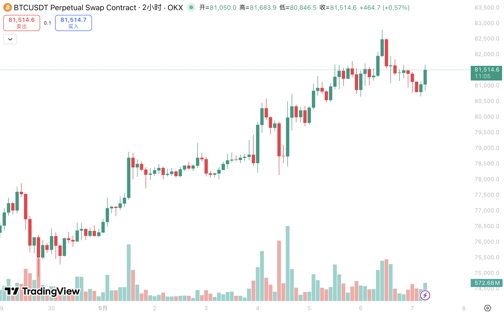

Had a pretty packed May Day holiday. If I don't get this post out now, the memories are going to expire on me — so here I am, stealing a moment to write it all down.

## April 28 | Customs Health Check

Things were slow before the holiday, so I booked a physical at the General Administration of Customs. I haven't been to Dongcheng District in ages — the whole area has such an old-school feel to it, lol. Since I still have my F-1 visa from UC Berkeley, the checkup was free. I got there early, grabbed a number, and was called in after about twenty minutes. They ran through everything one by one starting with a blood panel. When a doctor asked for my height and weight, I completely blanked on my weight and just gave a number — turned out to be off by a few pounds. Shouldn't matter though, I think......

Every doctor along the way said I was in great shape, which was honestly confusing, because my body feels like that of an elderly person (sad). I get lower back pain constantly, and sometimes I just can't catch my breath. Might be time for a massage. Youth is no shield, apparently.

While I was there, I went ahead and got some overdue vaccines — an A+C meningococcal shot. The last time I had that one was in fifth grade, so the record had long expired. For some reason they used an intramuscular syringe for what should've been a subcutaneous injection — maybe I'm remembering wrong though (

After the checkup, my dad and I went to a Xinjiang noodle place we always go to. As good as ever. I really need noodles in my life, and I'm genuinely hoping I'll find something even half as good in the States to rescue my soul.

## April 29 | Kite Flying

On the 29th, school cancelled the last two periods and took us to Taiyang Palace Park nearby to fly kites.

The afternoon sky was completely clear — not a cloud in sight — but unfortunately there wasn't a breath of wind either, and it was hot. You can't make something from nothing, so a lot of classmates couldn't get their kites up at all and just ended up sprinting around dragging them. Then, of course, two hours later when the activity wrapped up, the wind finally decided to show up.

Our class is small, so everyone got their own kite. Once mine was up I went around helping others get theirs airborne. My grandpa is a seasoned kite-flying pro, so even without a reel, I'm quick enough with my hands to let line out fast — I still managed to get a pretty good length up there.

## May 1–3 | Panshan Trip

For the first three days of the holiday, I went to Panshan in Tianjin with a group of friends — adults and kids alike, mostly my parents' friends.

### May 1

The foot of Panshan is packed with farmhouse-style guesthouses, and with our numbers, we basically took over one of them. This was my second time here, so I knew the drill. A lot has changed since the first visit — the pavilion that used to sit in the middle of the lake has been converted into a guest room. We checked out the local market at the base of the mountain, which had all kinds of dried goods plus a surprising amount of fireworks — we picked up some sparklers. They looked great at night.

I had my camera and tripod with me and wanted to shoot the moon — it was the 15th of the lunar month, so a full moon. I hauled everything up to the roof, only to realize I'd left my memory card in my room. By the time I ran back and got it, the sky had clouded over completely. The visibility was terrible, and the moon came out as nothing more than a soft, hazy glow with a vague outline. Given the conditions, I ended up not keeping any of the shots.

### May 2

Early morning on the 2nd, we headed up the mountain — just a few adults and us kids. The rest stayed at the inn to play mahjong. It was a 20-minute walk just to reach the base of the actual trail, and then the climb began.

The shooting conditions were excellent that day. I got a lot of great photos and videos of the younger kids. Along the trail there were NPCs dressed in Qing Dynasty merchant costumes selling things — there was even someone cosplaying as the Qianlong Emperor. Given that this was one of the imperial family's favorite retreats, the park really goes all out.

After walking for a couple of hours, we reached what looked like a big rest platform and thought we'd gotten somewhere — only to realize we'd barely hit the actual scenic area entrance. Everything before that was just the approach trail outside the gate. By that point it was already 11 AM, and since we weren't planning to eat up there, we turned back shortly after entering.

Then things got dramatic. Near a waterfall on the way back, there was a rocky side path that a few people took, and I followed with my camera. I was filming as I went, focused on the shot, and when I hopped across the waterfall rocks, I landed on a wet leaf and went straight down. My first instinct was to protect the camera, so I threw my left hand out to catch myself — my left ankle rolled badly, and my hand got scraped up in a few places. The camera was fine, thankfully. After seeing me hurt, the group decided to head back and have lunch at the inn. So much for exploring more of the mountain — I spent the rest of the afternoon stuck inside playing mahjong with the adults.

### May 3

The least congested day of the whole holiday. We left early and made it back to Beijing in just over an hour with no stops at all.

## May 4 | Car Wash Day

Same group of people, this time gathering near the northwest Fifth Ring Road. One of our friends' relatives owns a parking lot out there — we went for a cookout and used the hoses to wash the cars. Spent basically the whole day on it. My dad's car came out absolutely gleaming.

## May 5 | Recovery

Last day of the holiday. Stayed home and rested. The big exams are coming up and my mental state is somehow still incredibly relaxed about it. The only thing that actually needs sorting right now is the university enrollment paperwork — high school will wrap itself up on its own.

---

## What I've Been Up To

### Claude

Finally — I'm using Claude now. Anthropic's risk controls are notoriously strict: even the slightest DNS leak or a flagged IP can get you banned on the spot. One of my Google accounts got shut down without warning because of this, which is why I'd been sticking with GPT. But I've always wanted an AI with a bit more personality, so when I came across a reasonably priced residential IP provider on YouTube, I grabbed it, set up a fingerprint browser, and that's how I finally got Claude up and running.

As for Claude Code, which has been all over the internet lately, I haven't started using it yet. Partly because I can't afford to get my main account banned again !!(that would genuinely be it for me — if my main account gets nuked I might as well be done; I'm heading to the US soon anyway, and since I don't have much of a programming foundation yet, I can just pick it up there)!! Partly because I genuinely don't have many use cases for it right now. I briefly thought about connecting it to my Obsidian to help summarize notes, but then realized I'm not really taking that many notes these days — so that's on the backburner.

Claude and ChatGPT are genuinely two completely different products. To get up to speed quickly, I had GPT write me a sort of "reference letter" along with a bunch of documentation, to help Claude form an initial understanding of who I am and what I've been working on. The differences were obvious right from the first session.

GPT tends to give me multiple options, and whatever direction I want to explore, it follows my lead and unpacks everything in detail. Claude, on the other hand, seems to process faster — and when I ask a question, it often turns it back on me to clarify what I actually need. Sometimes it just starts working without any preamble, and by the time I've caught up there's already a pile of finished code and files sitting in front of me. Claude also pushes back sometimes, offering takes that are completely opposite to what I was thinking — and they tend to land. As someone who's spent so long with GPT, the adjustment has been jarring. But I'm also seeing something in Claude that GPT never quite gave me. Still in the adaptation phase — here's hoping I make good use of this new friend.

### Personal Asset Organization & Account Migration

Time has flown since I turned 18. Between mock exams and monthly tests, I've never had the bandwidth to properly manage my accounts and assets (not that I have much in the way of assets). With a new Google account to set up and my motivation for studying basically bottomed out, I've been chipping away at this with AI's help.

First up: password management. I need something solid to untangle all my accounts. Beyond browser autofill, I need a dedicated, secure place to store everything properly. I'd been using Bitwarden for a while — industry standard, works well. But this time I switched to KeePassXC, a locally encrypted manager. I've always had a strong aversion to the cloud. It's not that I dislike syncing — it's more that in China's current environment, anything uploaded to the cloud before being encrypted locally just makes me uneasy. My current setup: KeePassXC as the password manager (with TOTP support), and a new Obsidian vault as a ledger — not storing the credentials themselves, just recording what exists and where, and when it was last updated. On top of that, VeraCrypt, which I haven't set up yet, but it creates an encrypted container you can mount like a drive. I'm planning to put important documents there — passport PDFs, university I-20, that kind of thing — for safekeeping.

I've also been slowly learning trading, though time is short and progress feels slow — I need to push myself harder. Got my N26 IBAN sorted, so I now have a properly licensed European bank account and a debit card that works for actual spending. The Fiat24 card bundled with my Bitget Wallet kept getting declined everywhere — probably only useful for food delivery at this point. Beyond N26, I've also set up a Wise account for currency exchange, with significantly lower fees than a regular bank. After a few months of work, my overseas spending infrastructure is finally coming together. Next steps: a Hong Kong card when I get the chance, and a Bank of America account once I'm stateside — then it'll feel properly sorted.

### Recent Market Activity

Genuinely shocked — BTC broke through $82,000 and looks like it's holding. ETH followed and climbed back above $2,400. If BTC keeps recovering and potentially breaks the four-year cycle to hit $100K, I might need to revise my whole outlook upward.

### Gaming

#### CS2

Zero time for gaming lately. Still rotating between Perfect World and 5E, not hitting A-rank on either. Not sure if I'll manage to hit that goal before leaving for the US. What I really should be doing is grinding callouts and utility lineups — only knowing Mirage isn't going to cut it on Faceit, where maps are random and you can't afford to be weak anywhere.

#### KARDS

Back in after a long absence. I drifted away once the ranked rotation changed, but recently picked it back up — partly because the devs announced a new ally nation is coming (ANZAC), and partly because the gaming scene has been pretty sparse otherwise. Single-player games haven't been holding my attention, and outside of CS, I don't have many people to play with online.

The ranked meta is still a mess — aggro everywhere — but at least Germany-Japan is viable, and some people are running Soviet-Italy, which I appreciate. That said, I really miss the era when Germany-America big-swing decks were around. Since Comet and Fortress entered the rotation I've mostly been playing Classic: Gold Card Soviet, Britain-America big swing, America swing, Confiscation, Japan discard, and so on. Slow-tempo games are just more my thing. When it's aggro and the whole match boils down to who drew better, it gets stale fast. I hope the devs can keep the pace of updates and balance changes under control in this era of power creep. Strange that someone with a genuinely terrible grasp of actual WWII history would be this into a WWII card game — but here I am, and I'd genuinely recommend it to anyone.

#### TFT (Teamfight Tactics)

Barely touched the new season after it launched. I came in during S15, then S16 dropped right after I got back to China, and before I'd figured that one out, S17 was already here. Just trying to keep up at this point. Currently learning a trait comp — Supernova *(CN server name; exact global server equivalent unconfirmed)* — with Kayle as the main carry, and planning to eventually work through the other trait lines too, like the Phantom Squadron *(CN server name; exact global server equivalent unconfirmed)* late-game farm comp. My macro sense is okay but my game knowledge is still pretty shallow. Will revisit once the season gets another patch or two.

---

## Graduation Season Has Really Begun

Two weeks of high school left. There's so much to wrap up, and the exams can wait. Six years with this school — where does it go from here? Honestly, after junior and senior year, there's a lot I've come to resent about this place. The systems and certain teachers have stopped doing what they're supposed to do and started feeling more like restraints, like labels forced onto students. I know this isn't something that changes easily. In an era where admission results keep getting harder to predict, all I can do is wish the school luck. I'll write a proper send-off when graduation day comes around.
